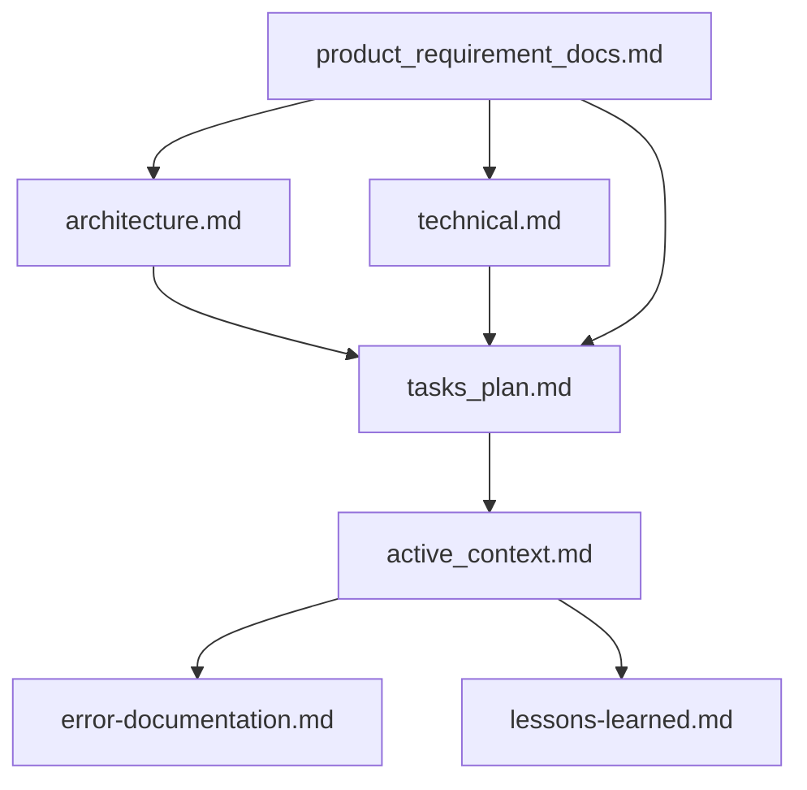

# Xpandia — Claude Code Configuration

## Project Identity

- **Name**: Xpandia
- **Domain**: Spanish expertise firm for AI, SaaS, EdTech and digital product teams — three service lines: Language Assurance (validate), Localization & Adaptation (adapt), Applied Cultural Intelligence (understand). Helps teams validate, localize and culturally adapt Spanish experiences for Hispanic and Spanish-speaking audiences.
- **Contact**: `hello@xpandia.global`
- **Stack**: Django 6 + DRF (backend) / Next.js 16 + React 19 + TypeScript (frontend) / MySQL 8 / Redis / Huey
- **Backend Django project**: `base_feature_project` (template scaffold name, kept by design)
- **Backend Django app**: `base_feature_app` (template scaffold name, kept by design — houses User and auth infrastructure)
- **Server paths & services**: `TBD` — set once staging/production is provisioned

---

## General Rules

These should be respected ALWAYS:
1. Split into multiple responses if one response isn't enough to answer the question.
2. IMPROVEMENTS and FURTHER PROGRESSIONS:
- S1: Suggest ways to improve code stability or scalability.
- S2: Offer strategies to enhance performance or security.
- S3: Recommend methods for improving readability or maintainability.
- Recommend areas for further investigation
3. i18n: user-facing strings live in `frontend/messages/<locale>/<namespace>.json` — never hardcode copy in components. Use `getTranslations` (server) / `useTranslations` (client). Adding a new page means creating a `messages/en/<ns>.json` + `messages/es/<ns>.json` with the same keys and registering the namespace in `frontend/i18n/request.ts`.

---

## Security Rules — OWASP / Secrets / Input Validation

### Secrets and Environment Variables

NEVER hardcode secrets. Always use environment variables.

```python
# ✅ Django — use env vars
import os
from dotenv import load_dotenv

load_dotenv()

SECRET_KEY = os.environ['DJANGO_SECRET_KEY']
DATABASE_URL = os.environ['DATABASE_URL']

# ❌ NEVER do this
SECRET_KEY = 'django-insecure-abc123xyz'
```

```typescript
// ✅ Next.js — use env vars
const apiUrl = process.env.NEXT_PUBLIC_API_URL
const secretKey = process.env.API_SECRET_KEY  // server-only, no NEXT_PUBLIC_ prefix

// ❌ NEVER do this
const API_KEY = 'sk-live-abc123xyz'
```

### .env rules

- `.env` files MUST be in `.gitignore`. Always verify before committing
- Use `.env.example` with placeholder values for documentation
- Separate env files per environment: `.env.local`, `.env.staging`, `.env.production`
- Server secrets (API keys, DB passwords) NEVER go in client-side env vars
- In Next.js: only `NEXT_PUBLIC_*` vars are exposed to the browser

### Input Validation

NEVER trust user input. Validate on both server AND client.

#### Django/DRF

```python
# ✅ Serializer validates input
class ContactSerializer(serializers.Serializer):
    email = serializers.EmailField()
    message = serializers.CharField(max_length=2000)
```

#### React

```typescript
// ✅ Validate before sending
import { z } from 'zod'

const contactSchema = z.object({
  email: z.string().email(),
  message: z.string().min(1).max(2000),
})
```

### SQL Injection Prevention

```python
# ✅ Django ORM — always safe
users = User.objects.filter(email=user_input)

# ✅ If raw SQL is needed, use parameterized queries
from django.db import connection
with connection.cursor() as cursor:
    cursor.execute("SELECT * FROM base_feature_app_user WHERE email = %s", [user_input])

# ❌ NEVER interpolate user input into SQL
cursor.execute(f"SELECT * FROM base_feature_app_user WHERE email = '{user_input}'")
```

### XSS Prevention

```typescript
// ✅ React auto-escapes by default — JSX is safe
return <p>{userInput}</p>

// ❌ NEVER use dangerouslySetInnerHTML with user input
return <div dangerouslySetInnerHTML={{ __html: userInput }} />

// If you MUST render HTML, sanitize first
import DOMPurify from 'dompurify'
const clean = DOMPurify.sanitize(userInput)
```

### CSRF Protection

```python
# ✅ Django — CSRF middleware is on by default, keep it
MIDDLEWARE = [
    'django.middleware.csrf.CsrfViewMiddleware',  # NEVER remove
    ...
]

# ✅ DRF — use JWT via rest_framework_simplejwt
REST_FRAMEWORK = {
    'DEFAULT_AUTHENTICATION_CLASSES': [
        'rest_framework_simplejwt.authentication.JWTAuthentication',
    ],
}
```

### Authentication and Authorization

```python
# ✅ Always check permissions
from rest_framework.permissions import IsAuthenticated

class MyViewSet(viewsets.ModelViewSet):
    permission_classes = [IsAuthenticated]

    def get_queryset(self):
        return MyModel.objects.filter(user=self.request.user)
```

### Sensitive Data Exposure

```python
# ✅ Exclude sensitive fields from serializers
class UserSerializer(serializers.ModelSerializer):
    class Meta:
        model = User
        fields = ['id', 'email', 'first_name', 'last_name']
        # password, tokens, internal IDs are excluded
```

### HTTP Security Headers (Django)

```python
# settings.py — enable all security headers
SECURE_BROWSER_XSS_FILTER = True
SECURE_CONTENT_TYPE_NOSNIFF = True
X_FRAME_OPTIONS = 'DENY'
SECURE_HSTS_SECONDS = 31536000
SECURE_HSTS_INCLUDE_SUBDOMAINS = True
SECURE_SSL_REDIRECT = True  # in production
SESSION_COOKIE_SECURE = True
CSRF_COOKIE_SECURE = True
SESSION_COOKIE_HTTPONLY = True
```

### Dependency Security

- Run `pip audit` (Python) and `npm audit` (Node) regularly
- Pin exact dependency versions
- Review new dependencies before adding them
- Keep dependencies updated, especially security patches

### File Upload Security

```python
# ✅ Validate file type and size
ALLOWED_EXTENSIONS = {'.jpg', '.jpeg', '.png', '.pdf'}
MAX_FILE_SIZE = 5 * 1024 * 1024  # 5MB

def validate_upload(file):
    ext = Path(file.name).suffix.lower()
    if ext not in ALLOWED_EXTENSIONS:
        raise ValidationError(f'File type {ext} not allowed')
    if file.size > MAX_FILE_SIZE:
        raise ValidationError('File too large')
```

### Security Checklist — Before Every Deployment

- [ ] No secrets in code or git history
- [ ] `.env` is in `.gitignore`
- [ ] All user input is validated (server + client)
- [ ] No raw SQL with user input
- [ ] No `dangerouslySetInnerHTML` with user data
- [ ] CSRF protection enabled
- [ ] Authentication required on all sensitive endpoints
- [ ] Serializers exclude sensitive fields
- [ ] Security headers configured
- [ ] `pip audit` / `npm audit` clean
- [ ] File uploads validated
- [ ] DEBUG = False in production
- [ ] ALLOWED_HOSTS configured properly

---

## Memory Bank System

This project uses a Memory Bank system to maintain context across sessions. The core files are:



### Core Files (Required)

| # | File | Purpose |
|---|------|---------|
| 1 | `docs/methodology/product_requirement_docs.md` | PRD: why Xpandia exists, core requirements, scope |
| 2 | `docs/methodology/architecture.md` | System architecture, component relationships, Mermaid diagrams |
| 3 | `docs/methodology/technical.md` | Tech stack, dev setup, design patterns, technical constraints |
| 4 | `tasks/tasks_plan.md` | Task backlog, progress tracking, known issues |
| 5 | `tasks/active_context.md` | Current work focus, recent changes, next steps |
| 6 | `docs/methodology/error-documentation.md` | Known errors, their context, and resolutions |
| 7 | `docs/methodology/lessons-learned.md` | Project intelligence, patterns, preferences |

### When to Read Memory Files

- Before significant implementation tasks, read the relevant core files
- Before planning tasks, read `docs/methodology/` and `tasks/`
- When debugging, check `docs/methodology/error-documentation.md` for previously solved issues

### When to Update Memory Files

1. After discovering new project patterns
2. After implementing significant changes
3. When the user requests with **update memory files** (review ALL core files)
4. When context needs clarification
5. After a significant part of a plan is verified

---

## Directory Structure

- Backend: `base_feature_app/` Django app, `base_feature_project/` Django project root
- Frontend: `app/[locale]/` (Next.js App Router under a locale segment), `components/`, `lib/`, `messages/<locale>/`, `i18n/`, `e2e/`
- Current Xpandia routes: bilingual site under `app/[locale]/` with `next-intl` `localePrefix: 'as-needed'`. English is unprefixed (`/`, `/about`, `/contact`, `/blog`, `/blog/[slug]`, `/services`, `/services/language-assurance`, `/services/localization-adaptation`, `/services/applied-cultural-intelligence`); Spanish lives under `/es/…` (e.g. `/es/services/language-assurance`). The header EN|ES toggle switches locale by replacing the current pathname. Legacy `/services/qa`, `/services/audit`, `/services/fractional` 308-redirect to `/services/language-assurance` (configured in `frontend/next.config.ts`).
- i18n wiring: locale config in `frontend/i18n/routing.ts` (+ `frontend/lib/i18n/config.ts` for the locale list and date helpers); request config in `frontend/i18n/request.ts`; middleware in `frontend/proxy.ts` (Next.js 16 middleware file); copy lives in `frontend/messages/<locale>/<namespace>.json`. Spanish copy is currently a draft pending client review.
- Current backend surface: `/api/health/`, `/api/token/`, `/api/token/refresh/`, `/api/` auth endpoints, `/api/users/`, `/api/google-captcha/`, `/api/blog/`, `/api/contact/`

---

## Testing Rules

### Execution Constraints

- **Never run the full test suite** — always specify files
- **Maximum per execution**: 20 tests per batch, 3 commands per cycle
- **Backend**: Always activate venv first: `source venv/bin/activate && pytest path/to/test_file.py -v`
- **Frontend unit**: `npm test -- path/to/file.spec.ts`
- **E2E**: max 2 files per `npx playwright test` invocation
- Use `E2E_REUSE_SERVER=1` when dev server is already running

### Quality Standards

Full reference: `docs/TESTING_QUALITY_STANDARDS.md`

- Each test verifies **ONE specific behavior**
- **No conjunctions** in test names — split into separate tests
- Assert **observable outcomes** (status codes, DB state, rendered UI)
- **No conditionals** in test body — use parameterization
- Follow **AAA pattern**: Arrange → Act → Assert
- Mock only at **system boundaries** (external APIs, clock, email)

---

## Error Documentation — Xpandia

No documented errors yet.

---

## Methodology Maintenance

- Memory Bank based on [rules_template](https://github.com/Bhartendu-Kumar/rules_template)
- Refresh memory files after adding a new Django app, significant test changes, or when file counts drift >10%
<!-- session-start-protocol:begin -->
## Session Start Protocol

Al inicio de **cada sesión y antes de editar archivos**, debes invocar la skill `git-sync` para este repo. Razón: el operador trabaja desde múltiples máquinas y procesos automatizados (cron, CI) pueden haber commiteado cambios que tu copia local no tiene; editar sobre una versión desactualizada genera conflictos o trabajo duplicado.

**Flujo:**
1. Un hook `SessionStart` (definido en `.claude/settings.json`) ejecuta `git fetch + git status` read-only y te inyecta el estado de este repo como contexto.
2. Si el reporte indica `behind > 0` o `dirty > 0`, **invoca la skill `git-sync`** antes de hacer cualquier cambio. `git-sync` hace rebase contra el parent branch y, si hay conflictos, te guía interactivamente por la resolución.
3. Si el reporte indica `behind=0 ahead=0 dirty=0`, el repo ya está sincronizado y puedes proceder.

**Importante:** Nunca uses `git pull --force`, `git reset --hard` ni stash automático para "resolver" el sync — usa siempre la skill `git-sync`, que es segura y reproducible.
<!-- session-start-protocol:end -->
<!-- e2e-user-flows-protocol:begin -->
## E2E User Flows Check

Cuando termines de implementar un cambio que afecte un **flujo de usuario en el frontend** — por ejemplo:
- Crear o editar un formulario (agregar/quitar campos)
- Nueva ruta, página o vista accesible al usuario
- Cambios en flujos de autenticación, checkout, onboarding, búsqueda, perfil
- Modificaciones a `docs/USER_FLOW_MAP.md` o `frontend/e2e/flow-definitions.json`

…debes invocar la skill `e2e-user-flows-check` como **paso final** antes de reportar la implementación como completa. Esa skill audita la cobertura E2E del flujo modificado y reporta brechas/riesgos.

**Por qué:** los flujos de usuario en frontend cambian las assumptions de los tests E2E. Sin auditoría, un campo eliminado deja tests "verdes" pero inválidos, y un form nuevo queda sin cobertura.

**No aplica para:** correcciones aisladas que no cambian el flujo (typos, refactors internos, estilos puros, dependency bumps), ni cambios solo en backend que no alteren UX.

**Recordatorio automático:** un hook `Stop` revisa al cierre del turno si hay cambios uncommitted bajo `frontend/src/`, `frontend/app/`, etc., y te lo inyecta como contexto. El hook es un recordatorio, no bloqueante — la regla aplica igual aunque el hook no dispare.
<!-- e2e-user-flows-protocol:end -->
<!-- git-branch-protocol:begin -->
## Reglas de trabajo con Git: ramas y commits

**Nunca hagas commits directamente sobre `main` o `master`.** Estas ramas están protegidas y los pushes serán rechazados por GitHub. Antes de cualquier `git commit`, sigue este protocolo:

### 1. Verificar la rama actual

Antes de cualquier operación de escritura (add, commit, etc.), ejecuta:

```bash
git rev-parse --abbrev-ref HEAD
```

### 2. Si la rama actual es `main` o `master`

Antes de crear una rama nueva, **busca si ya existe una rama feature activa** para este proyecto:

```bash
git fetch --quiet --prune
# Lista ramas remotas que no son main/master/release-* ni HEAD
git branch -r | grep -vE 'origin/(HEAD|main|master|release-)' | sed 's@^[[:space:]]*origin/@@' | sort -u
```

- **Si hay UNA rama feature activa** (con PR abierto o trabajo en curso): `git checkout <rama-existente>` y haz pull rebase si está atrás del remote. Commitea ahí. No crees rama nueva.
- **Si hay VARIAS ramas feature activas**: pregunta al usuario en cuál commitear (no asumas).
- **Si NO hay ninguna rama feature activa** (todas las que ves están mergeadas/cerradas o son ramas históricas abandonadas): crea rama nueva según el formato de la sección 3.

**Por qué:** la convención del proyecto es **máximo 1 PR feature activo simultáneamente**. Todos los cambios en curso se acumulan como commits sucesivos sobre esa rama hasta que mergee. Crear ramas paralelas fragmenta el trabajo en múltiples PRs y hace difícil hacer code review unificado.

**No pidas permiso para hacer el checkout** — sólo comunícalo: "Hay rama feature activa `<X>`, voy a commitear ahí."

### 3. Formato obligatorio del nombre de rama

`<prefijo>/<DDMMYYYY>-<descripcion-corta>`

- **`<prefijo>`** según el tipo de cambio:
  - `feat` — nueva funcionalidad
  - `fix` — corrección de bug
  - `docs` — cambios en documentación
  - `refactor` — refactorización sin cambio funcional
  - `test` — añadir o modificar tests
  - `chore` — mantenimiento (dependencias, configs)
  - `style` — formato/estilo, sin cambio de lógica
  - `perf` — mejoras de rendimiento
  - `ci` — cambios en workflows o pipelines
  - `hotfix` — corrección urgente en producción

- **`<DDMMYYYY>`** debe ser la fecha actual del sistema obtenida con `date +%d%m%Y`. Nunca la asumas ni la inventes.

- **`<descripcion-corta>`** en kebab-case, máximo 5 palabras, en inglés o español según el idioma del proyecto.

### 4. Ejemplos de nombres válidos

- `feat/15052026-login-google-oauth`
- `fix/15052026-typo-readme`
- `refactor/15052026-extract-user-service`
- `docs/15052026-update-deploy-guide`
- `chore/15052026-bump-django-version`

### 5. Comandos exactos a ejecutar

```bash
# 1. Obtener la fecha del día (no asumirla)
TODAY=$(date +%d%m%Y)

# 2. Crear y moverse a la nueva rama
git checkout -b <prefijo>/${TODAY}-<descripcion-corta>

# 3. Recién entonces hacer add y commit
git add <archivos>
git commit -m "<mensaje siguiendo conventional commits>"
```

### 6. Inferencia del prefijo

Determina el prefijo a partir del contenido de los cambios:
- Archivos nuevos que añaden features → `feat`
- Cambios que arreglan comportamiento roto → `fix`
- Solo cambios en `*.md`, comentarios o JSDoc → `docs`
- Cambios en `package.json`, `requirements.txt`, configs → `chore`
- Cambios en `.github/workflows/*` → `ci`
- Archivos `*test*` / `*spec*` modificados o añadidos → `test`
- Reorganización sin alterar comportamiento → `refactor`

Si hay ambigüedad, pregunta al usuario una sola vez antes de crear la rama.

### 7. Excepciones

- Operaciones de solo lectura (`git status`, `git log`, `git diff`, `git pull`, `git fetch`) están permitidas en `main`/`master`.
- Si el usuario explícitamente pide quedarse en `main` para revisar algo sin commitear, respeta esa intención.
- Si ya estás en una rama feature válida (no `main`/`master`), no crees una nueva — continúa trabajando en ella. **Esta es la convención por defecto: 1 rama / 1 PR feature activo por proyecto a la vez.**

### 8. Mensajes de commit

Sigue Conventional Commits, con el mismo prefijo de la rama cuando aplique:

```
feat: add Google OAuth login flow
fix: correct typo in deployment README
refactor: extract user validation into service
```

### 9. Reporte final: URL del PR

Después de cada `git push` que cree una rama nueva en el remote, **siempre** termina tu respuesta dando al usuario la URL "Create a pull request" que GitHub imprime en el output del push.

- Formato: `https://github.com/<owner>/<repo>/pull/new/<branch>`.
- Inclúyela como una de las **últimas líneas** del cierre de turno, etiquetada como `PR URL: <url>`.
- Si la rama ya existía y tiene un PR abierto, reporta la URL del PR existente (usa `gh pr view --json url -q .url` si la necesitas).
- Si por excepción se commiteó directo a `main`/`master` (sólo posible en proyectos sin esta regla), declara explícitamente: "PR URL: n/a (push directo a `main`)".
- Si hubo cambios en varios proyectos en el mismo turno, entrega una **lista** con un `PR URL:` por proyecto.
<!-- git-branch-protocol:end -->
