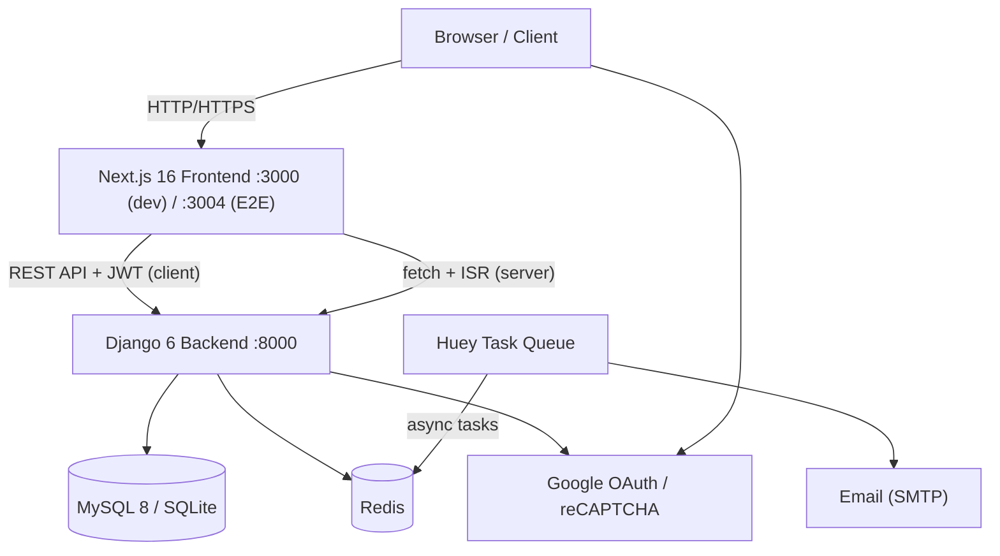
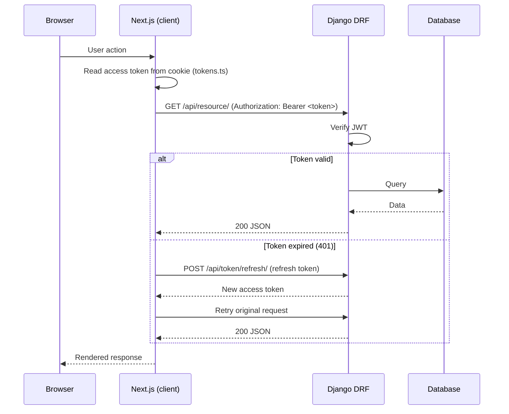
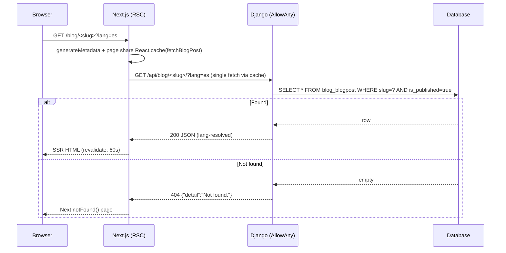
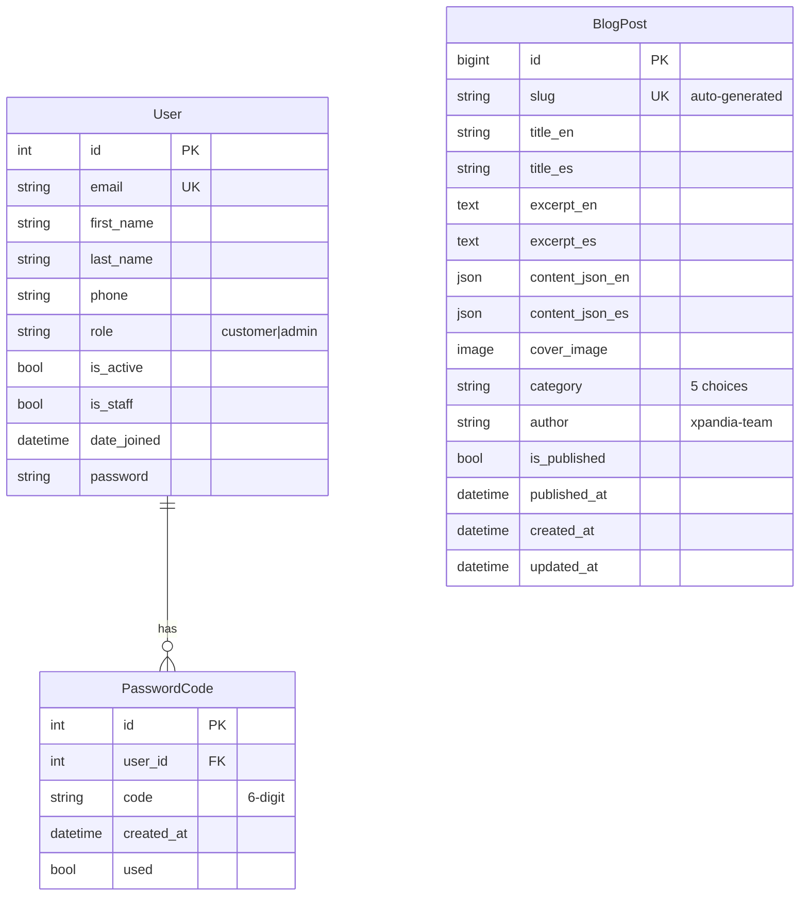
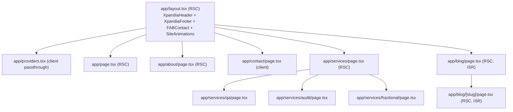
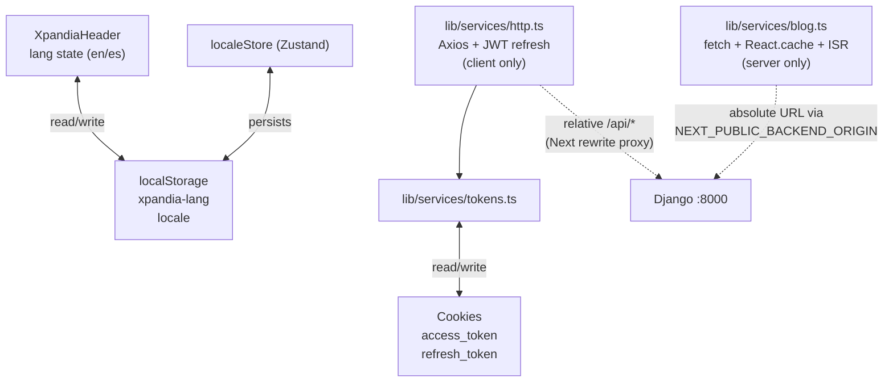
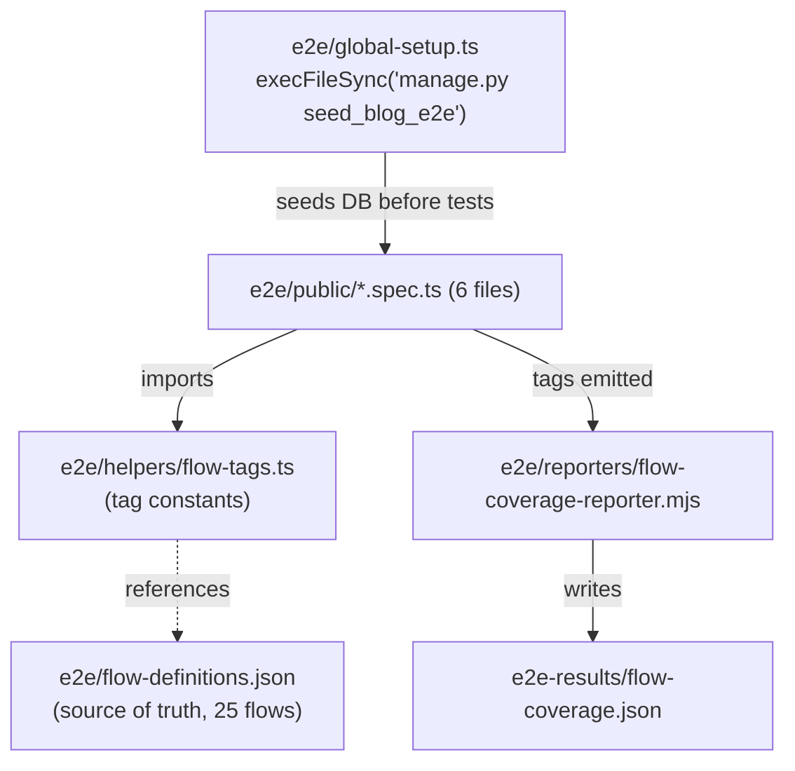
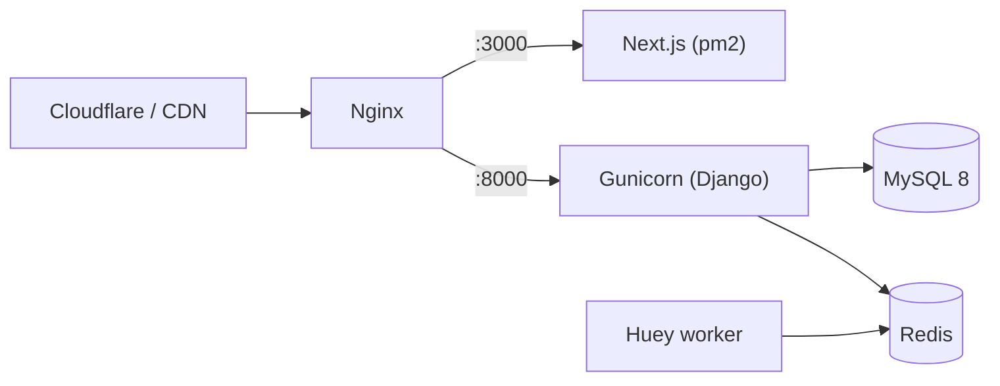

# Architecture — Xpandia

_Last verified: 2026-05-07_

## 1. System Overview



---

## 2. Request Flows

### 2a. Authenticated API call (client-side, JWT)



### 2b. Public blog detail (server-side, ISR)



---

## 3. Backend API Endpoints

### Root (`base_feature_project/urls.py`, 8 path entries)
| Method | Path | Purpose |
|--------|------|---------|
| GET | `/api/health/` | Health check |
| `*` | `/admin/` | Custom `BaseFeatureAdminSite` |
| `*` | `/admin-gallery/` | Default Django admin (rare use) |
| POST | `/api/token/` | Obtain JWT pair (SimpleJWT) |
| POST | `/api/token/refresh/` | Refresh access token |
| `*` | `/api/blog/` | Includes `blog.urls` |
| `*` | `/api/` | Includes `base_feature_app.urls` |

### Blog (`blog/urls.py`)
| Method | Path | Purpose | Auth |
|--------|------|---------|------|
| GET | `/api/blog/` | Paginated list of published posts | AllowAny |
| GET | `/api/blog/<slug>/` | Single published post detail | AllowAny |

Query params on both: `?lang=es|en` (default `en`), `?page=N`, `?page_size=K` (default 9, max 50, list only).

### Auth (`base_feature_app/urls/auth.py`, 7 paths)
| Method | Path | Purpose |
|--------|------|---------|
| POST | `/api/sign_up/` | Register new user |
| POST | `/api/sign_in/` | Login → returns JWT |
| POST | `/api/google_login/` | Google OAuth login |
| POST | `/api/send_passcode/` | Send password-reset code |
| POST | `/api/verify_passcode_and_reset_password/` | Verify code + new password |
| POST | `/api/update_password/` | Update password (authenticated) |
| GET | `/api/validate_token/` | Validate access token |

### Users (`base_feature_app/urls/user.py`, 2 paths)
| Method | Path | Purpose |
|--------|------|---------|
| GET, POST | `/api/users/` | List / create users |
| GET, PUT, PATCH, DELETE | `/api/users/<id>/` | User detail CRUD |

### Captcha (`base_feature_app/urls/captcha.py`, 2 paths)
| Method | Path | Purpose |
|--------|------|---------|
| GET | `/api/google-captcha/site-key/` | Get reCAPTCHA site key |
| POST | `/api/google-captcha/verify/` | Verify reCAPTCHA token |

### Contact (`base_feature_app/urls/contact.py`, 1 path)
| Method | Path | Purpose |
|--------|------|---------|
| POST | `/api/contact/` | Send contact form via email (AllowAny) |

---

## 4. Data Models (ER Diagram)



**Notes:**
- `User.role` choices: `customer` (default), `admin`
- `PasswordCode` expires after 15 minutes via `is_valid()` method
- `BlogPost.category` choices: `ai-quality`, `localization`, `case-study`, `industry`, `operations`
- `BlogPost.author` choices: `xpandia-team` (only)
- `BlogPost` has no FK to User — authorship is a CharField with hardcoded choices
- `django_attachments` provides a generic file attachment model (not yet used in views)

---

## 5. Frontend Route Architecture



---

## 6. Frontend State / Data-Fetching Architecture



**Key separation**: server-side `BlogSvc` calls Django directly with an absolute URL; client-side `Axios` goes through Next.js's rewrite proxy. They are intentionally distinct.

---

## 7. Component Hierarchy

```
app/layout.tsx
├── Providers (client wrapper, currently passthrough)
├── XpandiaHeader (client — scroll, drawer, lang toggle)
├── {children}  (page content)
│   └── Blog pages → BlogCard, BlogPagination, BlogLanguageToggle, BlogContentRenderer
├── XpandiaFooter (server)
├── FABContact (server)
└── SiteAnimations (client — GSAP, returns null)
```

---

## 8. E2E Test Architecture



---

## 9. Deployment Architecture (Planned)



**Status:** Staging/production not yet provisioned. Server paths TBD.
