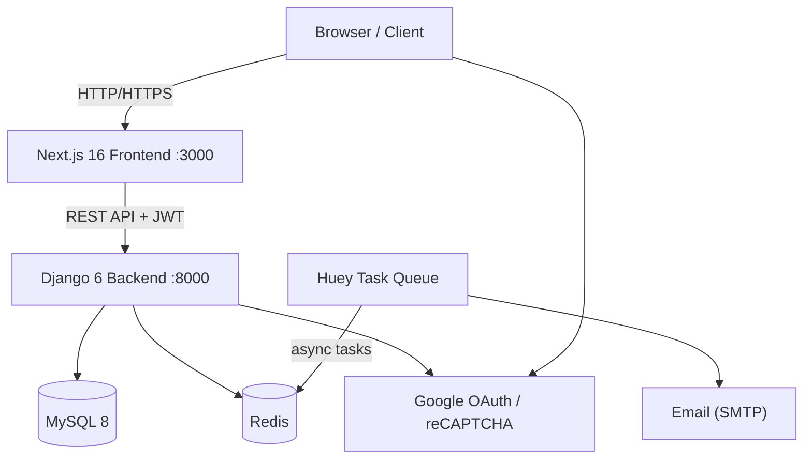
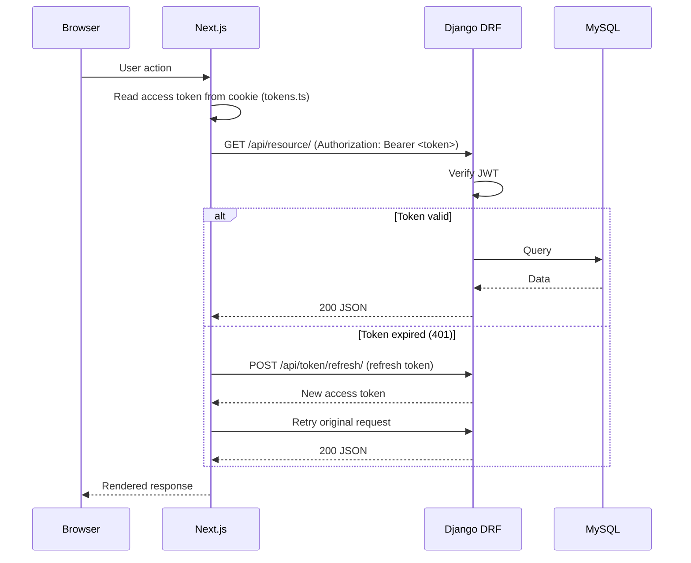
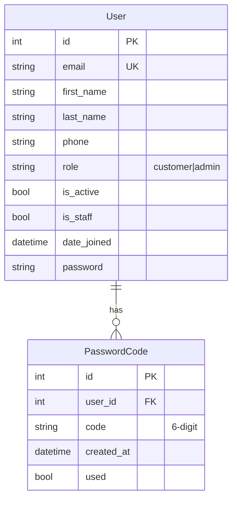
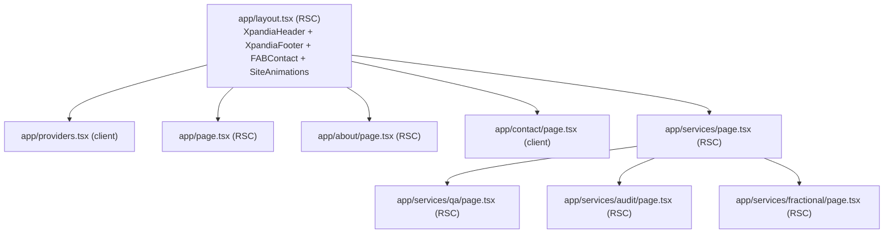
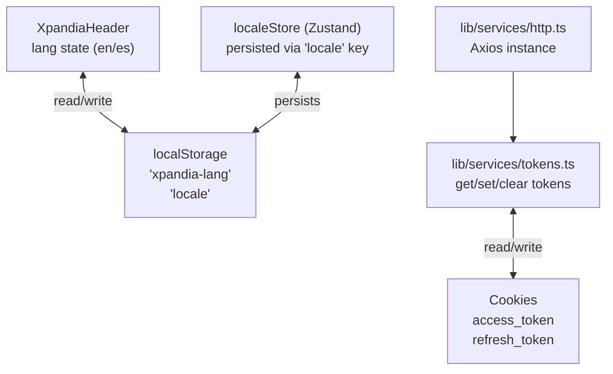
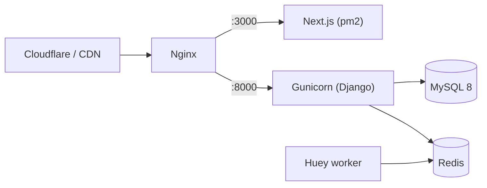

# Architecture — Xpandia

## 1. System Overview



---

## 2. Request Flow — Authenticated API Call



---

## 3. Backend API Endpoints

### Root (`base_feature_project/urls.py`)
| Method | Path | Purpose |
|--------|------|---------|
| GET | `/api/health/` | Health check |
| POST | `/api/token/` | Obtain JWT pair (SimpleJWT) |
| POST | `/api/token/refresh/` | Refresh access token |
| `*` | `/api/` | Includes `base_feature_app` URLs |

### Auth (`base_feature_app/urls/auth.py`)
| Method | Path | Purpose |
|--------|------|---------|
| POST | `/api/sign_up/` | Register new user |
| POST | `/api/sign_in/` | Login → returns JWT |
| POST | `/api/google_login/` | Google OAuth login |
| POST | `/api/send_passcode/` | Send password-reset code by email |
| POST | `/api/verify_passcode_and_reset_password/` | Verify code + set new password |
| POST | `/api/update_password/` | Update password (authenticated) |
| GET | `/api/validate_token/` | Validate access token |

### Users (`base_feature_app/urls/user.py`)
| Method | Path | Purpose |
|--------|------|---------|
| GET, POST | `/api/users/` | List users / create user |
| GET, PUT, PATCH, DELETE | `/api/users/<id>/` | User detail CRUD |

### Captcha (`base_feature_app/urls/captcha.py`)
| Method | Path | Purpose |
|--------|------|---------|
| GET | `/api/google-captcha/site-key/` | Get reCAPTCHA site key |
| POST | `/api/google-captcha/verify/` | Verify reCAPTCHA token |

---

## 4. Data Models (ER Diagram)



**Notes:**
- `User.role` choices: `customer` (default), `admin`
- `PasswordCode` expires after 15 minutes, enforced by `is_valid()` method
- `django_attachments` provides a generic file attachment model (not yet used in views)

---

## 5. Frontend Route Architecture



---

## 6. Frontend State Architecture



---

## 7. Component Hierarchy

```
app/layout.tsx
├── Providers (client wrapper, currently passthrough)
├── XpandiaHeader (client — scroll, drawer, lang toggle)
├── {children}  (page content)
├── XpandiaFooter (server)
├── FABContact (server)
└── SiteAnimations (client — GSAP, returns null)
```

---

## 8. Deployment Architecture (Planned)



**Status:** Staging/production not yet provisioned. Server paths TBD.
